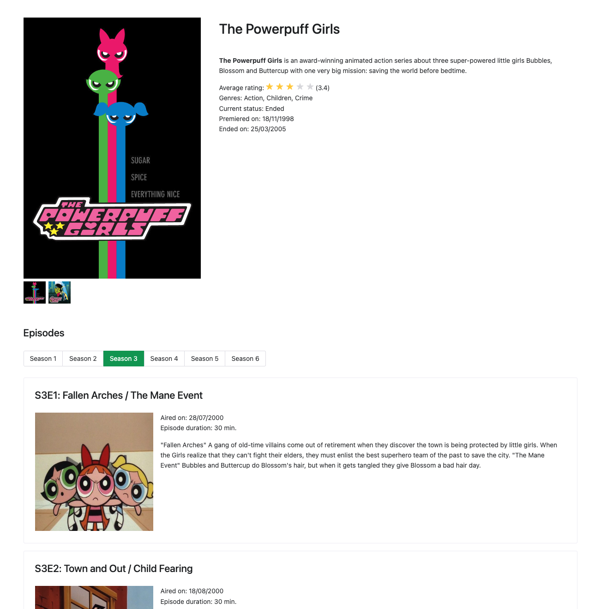

## Vue Project Challenge

A project that displays information about a given TV show using TV Maze API as a data source.

It consist of two pages, the first shows general information about the TV show, such as release date, images, seasons and episodes. The second gives more specific information about a given episode.

This project is built using Vue 3, Vite, Pinia, Axios and NaiveUI.

### Home screen:

### In order to see the project running, you can clone it and run the following commands:
###### PS: its a pre-requisite to have NodeJS installed
*  `npm i`
*  `npm run dev`
* Open your browser using the displayed URL
